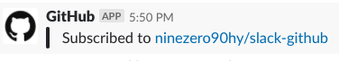
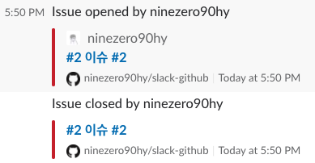
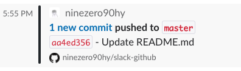

# slack-github (슬랙/깃허브 연동 설정) 😎

## 1. 플러그인 설치

[Slack + GitHub](https://github.com/marketplace/slack-github)

## 2. 슬랙 연결

- Subscribe to notifications for a repository: `/github subscribe owner/repository`
- e.g ) /github subscribe ninezero90hy/slack-github

## 3. 슬랙 메세지

- 이슈 등록/클로즈 or 소스 커밋이 되었을 때 알림 메세지

